# Dayboard by DD

A dashboard for your second monitor.

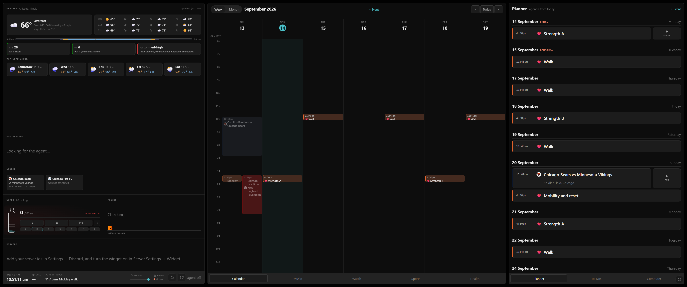

## What it is

Most desks have a screen that mostly shows a wallpaper. This turns that screen into the one place you look up.

The calendar sits in the middle. Every calendar you already keep (Google, iCloud, Outlook, the work one) lands on it in its own colour, and so do your teams' fixtures, your birthdays, and the day's workout.

Down the left: the weather, what's playing, the score, a water bottle, and who's in Discord voice. Nothing to click. You glance.

On the right, a row of tabs. The agenda, the to-dos, the machine's vitals, the mail, the packages on the way.

It refreshes itself every thirty seconds. There are no refresh buttons anywhere on it.

## Why it exists

I built the first version for myself over a summer, and it got personal fast. My teams, my subway lines, my zip code, my Discord name, hardcoded in forty places.

Friends kept asking for one. Handing over a copy meant an afternoon of find-and-replace, and the next friend meant another.

So this is the same board, with every personal thing pulled out into a settings menu. Clone it, run one script, and the guide opens on the board itself and walks you through what it can do.

## Setting it up

```powershell
git clone https://github.com/David-Dingess/dayboard-by-dd.git
cd dayboard-by-dd
powershell -ExecutionPolicy Bypass -File scripts\setup.ps1
```

That's it for the install. The script builds the board, registers it to start when you log in, and opens it fullscreen in its own Chrome window.

Then the guide opens.

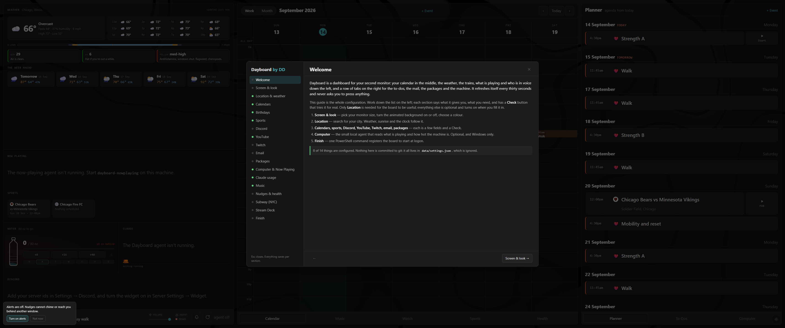

Eighteen sections down the left. Each one says what it gives you, what you need, and has a Check button that tries the thing for real. Only Location is required. Everything else turns on when you fill it in.

### Your screen

The board was drawn for a 3440 x 1440 ultrawide. Pick your monitor from the dropdown, or leave it on Auto and it measures the window.

The animated background can go off, and the ground colour is yours to change. Keep it dark. The palette assumes it.

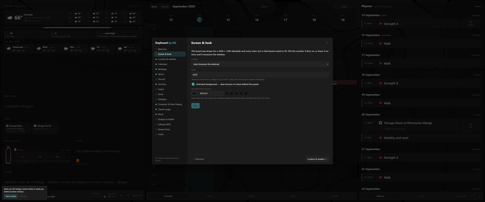

Here's the same board on a 1920 x 1080 screen.

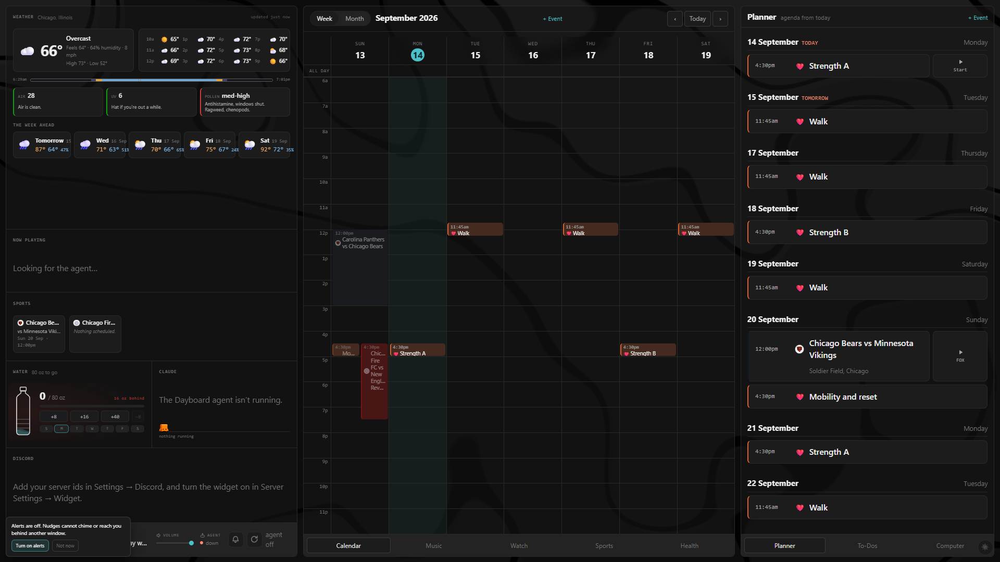

### Your city

Type it. Open-Meteo finds the coordinates and the timezone together, and the weather, sunrise, sunset and every date on the board follow.

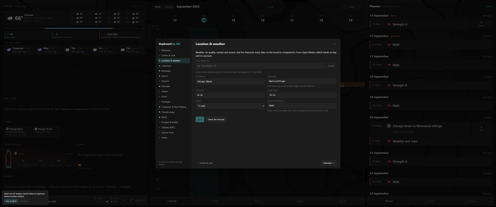

### Your teams

Pick a league, pick a team. That's the whole job.

Each team becomes a layer with its colour and crest: fixtures on the calendar with an alarm an hour before, a live score while it plays, a tile on the Sports tab that opens the right streaming site, and a pulse on the tab at kickoff. Tick the cups it also plays in.

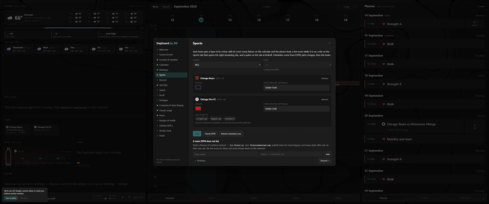

### Your calendars

Paste an ICS address. The section tells you where Google, iCloud and Outlook hide theirs.

The board also publishes everything back out as a feed your phone can subscribe to, with the team fixtures and their alarms included.

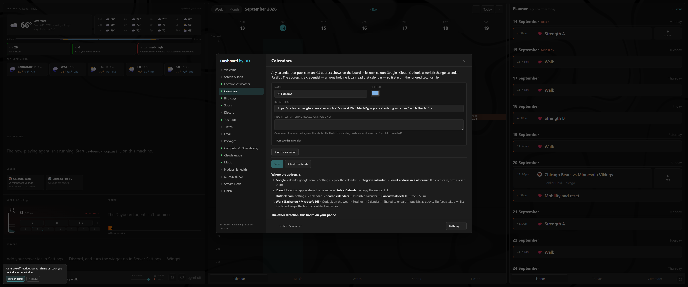

### The rest

Discord, YouTube, Twitch, email, Amazon packages, the PC agent, Claude usage, your music service, the nudges, the NYC subway if that's your city. Each is its own section with the manual steps written next to the fields they unlock.

## What's on the board

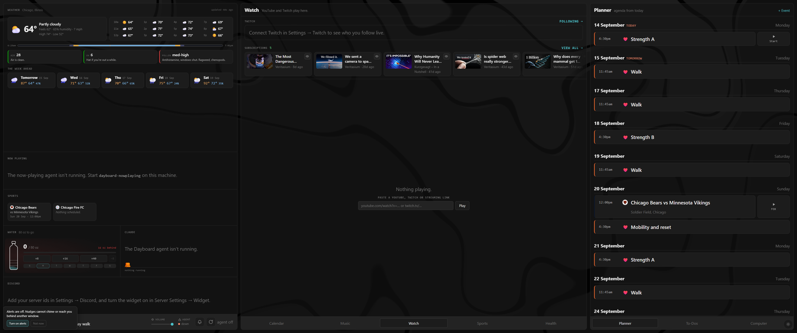

**Watch.** New uploads from the channels you pick, and the Twitch streams you follow that are live now. Click one and it plays in the board, not in a new tab. Switch to the calendar and it shrinks to a corner and keeps going.

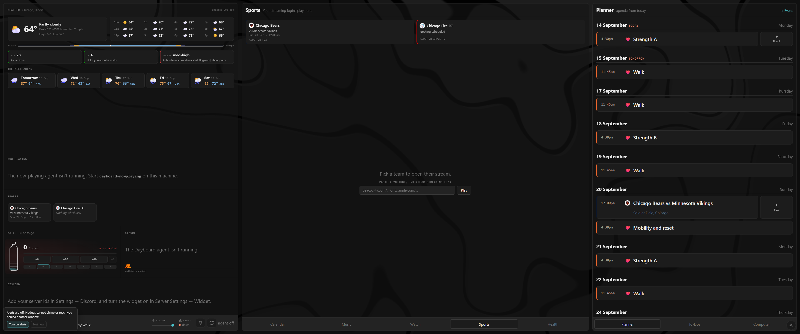

**Sports.** One tile per team with the next fixture and where it's on. Click it and the streaming site opens inside the board, in a real Chrome that the board frames. Sign in there once.

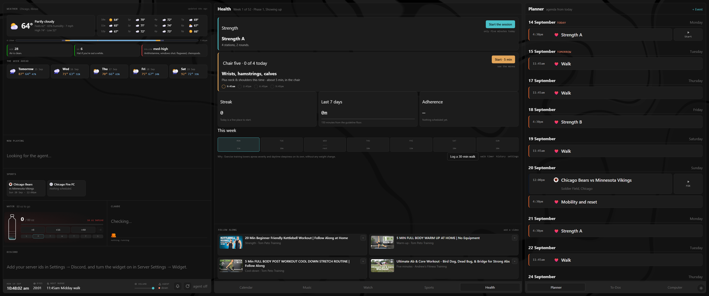

**Health.** A 52-week strength and mobility programme with the exercises drawn as animations, a walk timer, a five-minute chair routine, nudges at the times you choose, and a 20/20/20 eye break that blacks the screen out for twenty seconds every twenty minutes.

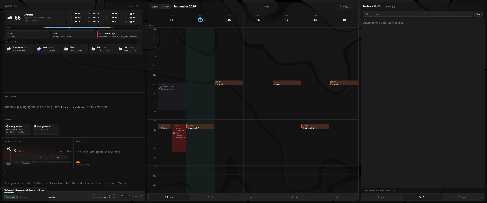

**To-Dos.** A checklist over a scratch page. Ticking a box deletes the to-do. The page saves itself.

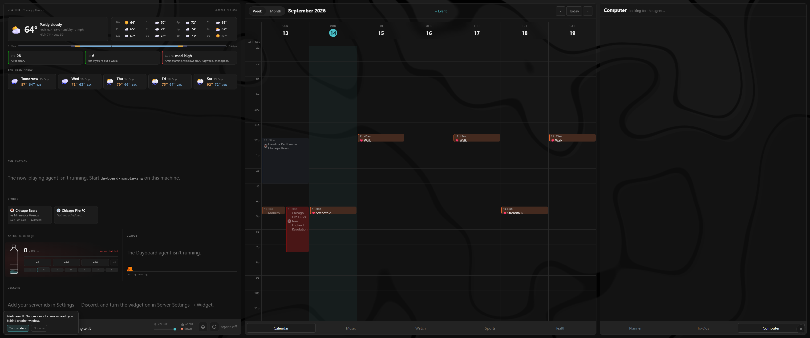

**Computer.** CPU, GPU, memory, fans, drives, network and the top five processes, from a small local agent. The same agent reads what Windows is playing for the Now Playing panel and switches your headphones and speakers if you run Voicemeeter.

## The Stream Deck

There's a plugin. Tabs on the top row, folders for the videos, the streams and the teams, then water, alerts, output, mute and reset along the bottom.

The keys draw themselves from the board. Key three in the Videos folder plays whatever is third right now.

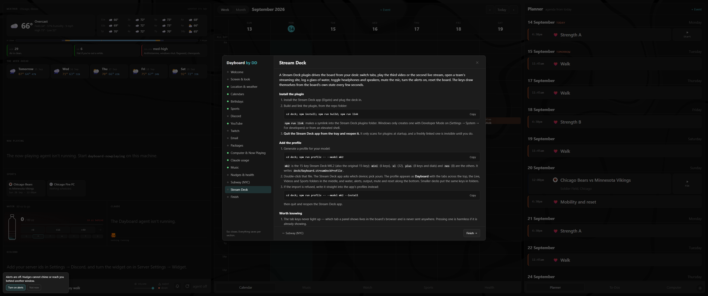

```powershell
cd deck
npm install
npm run build
npm run link
npm run profile -- --model mk2
```

Double-click the profile it writes and choose your deck. Mini, XL, Plus and Neo get their own layouts.

## What it needs

- Windows, for the agents and the framed windows. The board itself is a Next.js app and runs anywhere.
- Node 20.9 or newer, and Chrome.
- .NET 8 for the PC agent and the Sports and Music windows. Python 3 for the mail and package pollers. Both optional.

## What it doesn't do

The where-to-watch tables know US streaming services. Elsewhere it names the right competition and the wrong service.

YouTube plays anonymously, so ads run and a video with embedding turned off won't play. Every tile has a link out.

Packages works with amazon.com only, and it keeps your Amazon password on this machine in plain text. The section says so before you turn it on.

There's no login. The board listens on localhost and refuses every write from anywhere else. Your machine is the boundary.

## Under the hood

Next.js. JSON files as the database. No cloud, no accounts.

Everything you type into the guide goes into `data/settings.json`, which is ignored by git. The team schedules come from ESPN's public endpoints, refreshed daily by a scheduled task. Weather is Open-Meteo. Nothing here needs an API key.

The cat on the shelf is the OpenPets default pet, MIT licensed. The moving background is a recreation of ElliotIsLame's "Minimalist Black" for Wallpaper Engine.

`docs/architecture.md` has the rules worth knowing before you change anything. `docs/setup.md` is the whole guide in text form.

What would you put on yours?
